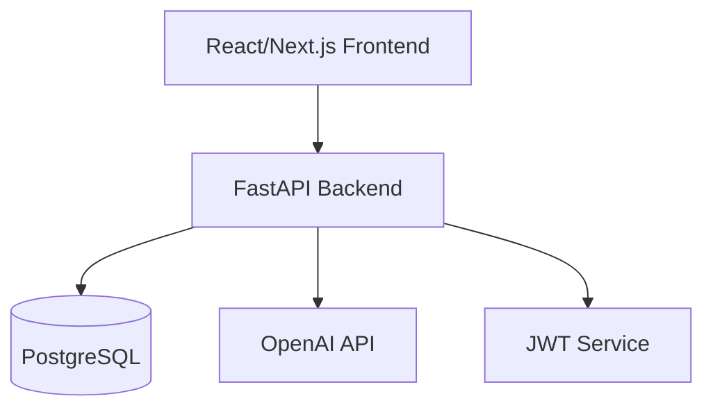

# Design: TaskFlow Pro SaaS Backend

## 1. Architecture



## 2. API Endpoints

| Method | Path                       | Description                 |
| :----- | :------------------------- | :-------------------------- |
| POST   | `/auth/login`              | Returns JWT token.          |
| GET    | `/tasks`                   | List user's tasks.          |
| POST   | `/tasks`                   | Create a new task.          |
| POST   | `/tasks/{id}/ai-breakdown` | Generate subtasks using AI. |

## 3. Data Models

### 3.1. Task

```python
class Task(BaseModel):
    id: UUID
    title: str
    description: Optional[str]
    status: Enum("TODO", "IN_PROGRESS", "DONE")
    owner_id: UUID
```

## 4. AI Integration

- **Prompt:** "Given the task '{title}', suggest 3-5 subtasks in JSON format."
- **Model:** `gpt-3.5-turbo` (for speed/cost).
