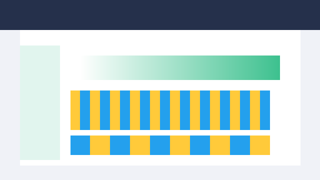
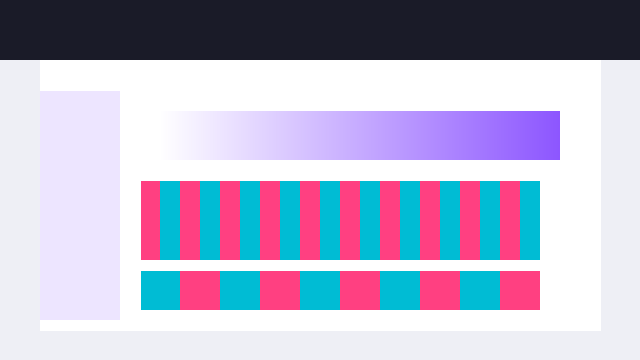
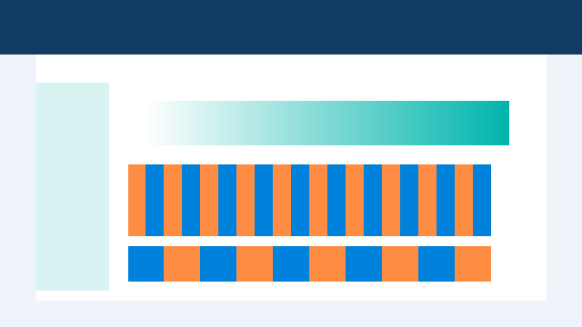
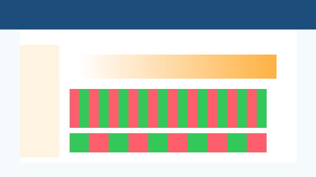

# Project Index

A comprehensive listing of all public demos and projects.

---

## 🤖 Automation

Workflow automation and process optimization projects.

### Driver Scoring Automation (Typeform → Zapier → Notion)

> Typeform intake auto-scores every driver submission, explains the risk level via OpenAI, and syncs actions to Notion plus Slack in under two minutes.

**Tech stack:** Typeform, Zapier, Notion, OpenAI

**Who this is for:** Commercial fleets, delivery networks, and marketplaces that need compliant onboarding at scale.

**How to try it:**
1. Clone the [automation-templates repository](https://github.com/RazonIn4K/automation-templates)
2. Import the Zapier (or n8n) workflow JSON found in `/driver-scoring`
3. Configure Typeform webhook, scoring thresholds, and Notion database IDs
4. Trigger the Typeform and watch the alerts and records generate in real time

#### Key Outcomes
- Risk scoring time cut from 45 minutes to <2 minutes
- Auto-generated Notion tasks ensure sub-80 scores get follow-up instantly
- Slack/Email alerts provide auditable history for compliance teams

- **Workflow**: [Driver Scoring Template](https://github.com/RazonIn4K/automation-templates/tree/main/driver-scoring)

---

### N8N Messaging Agent Platform

> n8n orchestrates omnichannel SMS + email replies with OpenAI-personalized copy for every real-estate inquiry.

**Tech stack:** n8n, Airtable, Twilio, SendGrid, OpenAI

**Who this is for:** Real estate teams that need 24/7 follow-up on listing requests without hiring extra ISAs.

**How to try it:**
1. Clone the [automation-templates repository](https://github.com/RazonIn4K/automation-templates)
2. Import the `/n8n-messaging-agent` workflow into your n8n instance
3. Connect Airtable API keys plus Twilio/SendGrid credentials
4. Toggle the AI tone settings and test an inbound Airtable record

#### Key Outcomes
- Median response time stays under 2 minutes even off-hours
- 38% lift in booked showings thanks to consistent AI-personalized scripts
- Airtable keeps a synchronized message history for every contact

- **Workflow**: [Messaging Agent Playbook](https://github.com/RazonIn4K/automation-templates/tree/main/n8n-messaging-agent)

---

### GHL Lead Capture & Slack Alert (n8n)

> Every GoHighLevel lead pushes straight into Google Sheets and Slack so sales can reply instantly.

**Tech stack:** n8n, GoHighLevel Webhooks, Google Sheets, Slack API

**Who this is for:** Marketing agencies and sales teams using GoHighLevel who want instant notifications when new leads show up.

**How to try it:**
1. Check out the [automation-templates repository](https://github.com/RazonIn4K/automation-templates) and follow the README for setup instructions
2. Import the n8n workflow JSON into your n8n instance
3. Configure your GoHighLevel webhook URL, Google Sheets credentials, and Slack webhook
4. Watch the [demo video](TODO - add Loom URL) to see it in action

#### Key Outcomes
- Sales reps get notified within 10 seconds of each form submission
- Google Sheets ledger eliminates duplicate follow-ups entirely
- Slack thread includes CTA buttons for qualify/assign workflows

- **Repository**: [automation-templates](https://github.com/RazonIn4K/automation-templates)
- **Demo Video**: TODO (add URL)

---

## 💬 Chatbots

Conversational AI and bot implementations.

### FAQ Chatbot Template (coming soon)

> Vector-search powered assistant that answers multilingual FAQs from your docs without touching engineering resources.

**Tech stack:** OpenAI/Claude API, vector DB (Pinecone/Chroma), simple web UI

**Who this is for:** Customer support teams that need always-on, accurate responses built from internal docs.

**How to try it:**
1. Repository coming soon at [chatbot-templates](https://github.com/RazonIn4K/chatbot-templates)
2. Upload your FAQ documents (PDF, Markdown, or text files)
3. Run the setup script to create embeddings and deploy the chatbot
4. See the [demo video](TODO - add Loom URL) for a walkthrough

#### Key Outcomes
- Reduces repetitive tickets by ~40% once live
- Supports 30+ languages automatically with the same knowledge base
- Offers human handoff plus CRM logging out of the box

- **Repository**: [chatbot-templates](https://github.com/RazonIn4K/chatbot-templates)
- **Demo Video**: TODO (add URL)

---

## 📊 Data Pipelines

Data processing, transformation, and ETL solutions.

### Scraping + Lead Gen Pipelines

> Playwright scrapers collect marketplace listings, enrich contacts, and hand sales teams verified leads overnight.

**Tech stack:** Python, Playwright, BeautifulSoup, Pandas, Slack, HubSpot/CSV exporters

**Who this is for:** Outbound teams that need fresh firmographic and contact data without manual research.

**How to try it:**
1. Clone the [data-pipeline-starters repository](https://github.com/RazonIn4K/data-pipeline-starters)
2. Copy the `/scraping-plus-lead-gen` starter workflow
3. Set marketplace URLs + enrichment API keys, then run `python pipeline.py`
4. Schedule via GitHub Actions or CRON for continuous delivery

#### Key Outcomes
- 500+ verified leads captured per day with no manual QA
- Bounce rates stay below 2% because of built-in validation
- Slack digest posts every morning with new target accounts

- **Workflow**: [Scraping Lead Engine](https://github.com/RazonIn4K/data-pipeline-starters/tree/main/scraping-plus-lead-gen)

---

### ShopMatch Product Scraper & Enricher

> CLI pipeline parses storefronts, enriches descriptions, and outputs CSVs ready for marketplaces.

**Tech stack:** Python, BeautifulSoup, CSV I/O, optional LLM enrichment

**Who this is for:** E-commerce teams and data analysts who need to extract product information from websites.

**How to try it:**
1. Clone the [shopmatch-pro repository](https://github.com/RazonIn4K/shopmatch-pro)
2. Install dependencies: `pip install -r requirements.txt`
3. Run the scraper: `python scraper.py --input sample_products.csv`
4. Check the (upcoming) [demo video](TODO - add Loom URL) for enhanced descriptions

#### Key Outcomes
- Extracts full product catalogs in minutes for price monitoring
- LLM enrichment drafts SEO-grade descriptions automatically
- Clean CSV exports drop into Shopify/Amazon without reformatting

- **Repository**: [shopmatch-pro](https://github.com/RazonIn4K/shopmatch-pro)
- **Demo Video**: TODO (add URL)

---

## 🔐 Security

Automation, AI, and guardrails packaged together so launches meet compliance standards.

### AI Integration & Security Audit Bundle

> Bundle a revenue-driving automation/chatbot implementation with a Prompt-Defenders style audit, so leadership gets outcomes and assurance in one sprint.

**Tech stack:** Zapier or n8n, OpenAI/LangChain, Notion/Slack, Prompt-Defenders scanners

**Who this is for:** B2B SaaS, agencies, and ops teams rolling out AI copilots that touch customer data or regulated systems.

**How to try it:**
1. Clone the [automation-templates repository](https://github.com/RazonIn4K/automation-templates) and open `/ai-integration-security`
2. Provide API keys plus the workflow you need automated (Typeform/Zapier/n8n/Slack)
3. Supply a list of systems that require audit coverage (CRMs, data warehouses, LLM prompts)
4. Review the delivered automation plus the red-team audit scorecard + remediation backlog

#### Key Outcomes
- Production-ready automation/chatbot delivered alongside hardened prompts
- Audit scorecard covering secrets, RBAC, and abuse prevention
- Monitoring hooks and backlog to keep legal/compliance satisfied after launch

- **Workflow**: [AI Ops + Guardrails](https://github.com/RazonIn4K/automation-templates/tree/main/ai-integration-security)
- **Audit Toolkit**: [prompt-defenders](https://github.com/RazonIn4K/prompt-defenders)

---

## Usage & Customization

These demos showcase real-world automation, AI chatbot, and data pipeline solutions that I use in client proposals and projects. Each demo is fully functional and can be customized to fit your specific use case:

- **For proposals:** Share relevant demos to show proof-of-concept capabilities
- **For customization:** All templates can be adapted to your tech stack, workflows, and business requirements
- **For integration:** Demos can be extended to connect with your existing CRM, databases, or APIs

Contact me to discuss how these solutions can be tailored to your needs.

---

## Adding New Projects

To add a new project to this catalog:

1. Choose the appropriate category (Automation, Chatbots, Data Pipelines, or Security)
2. Add a new entry following the format shown above with summary, thumbnail, and Key Outcomes
3. Update the README table and link out to the repo/workflow
